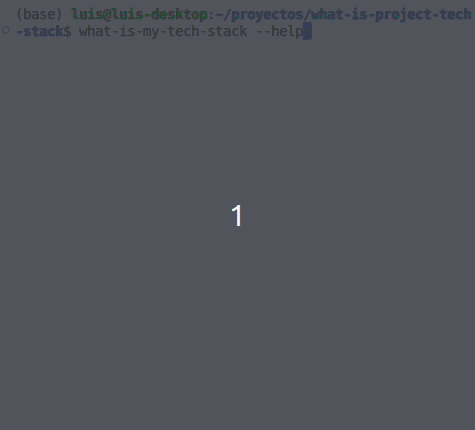

# What Is My Tech Stack?

🔍 AI-powered CLI tool that analyzes your project's tech stack. Perfect for CVs, documentation, and project insights.

<p align="center">
  
</p>

## Quick Start

```bash
# Install globally
npm install -g what-is-my-tech-stack

# Run in your project directory
what-is-my-tech-stack
```

## Features

- 🤖 AI-powered tech stack analysis
- 📦 Supports Node.js (package.json) and Python (requirements.txt)
- 🎯 Focus on frontend/backend/specific tech
- 📝 Multiple output formats (markdown, text, json, inline)
- 🔄 Version tracking support

## Example Outputs

### Default (Markdown)
```bash
what-is-my-tech-stack
```
```
testing
@types/jest
jest
ts-jest

linter
@typescript-eslint/eslint-plugin
@typescript-eslint/parser
eslint
eslint-config-prettier
prettier

typescript
@types/node
@types/ora
typescript

utilities
chalk
commander
dotenv

other
openai
ora
husky
```

### Inline Format
```bash
what-is-my-tech-stack --format inline
```
```
chalk, commander, dotenv, openai, ora, @types/jest, @types/node, @types/ora, @typescript-eslint/eslint-plugin, @typescript-eslint/parser, eslint, eslint-config-prettier, husky, jest, prettier, ts-jest, typescript
```

### JSON Format
```bash
what-is-my-tech-stack --format json
```
```json
{
  "typescript": [
    "@types/node",
    "@types/ora",
    "typescript"
  ],
  "utilities": [
    "chalk",
    "commander",
    "dotenv"
  ],
  "other": [
    "openai",
    "ora",
    "husky"
  ]
}
```


### Specific Tech Focus
```bash
what-is-my-tech-stack --tech-focus nodejs
```
```
typescript
• @types/node

utilities
• chalk
• commander
• dotenv
```

## Usage Options

```bash
# Basic usage (current directory)
what-is-my-tech-stack

# Specific directory
what-is-my-tech-stack --path ./my-project

# Output formats
what-is-my-tech-stack --format markdown
what-is-my-tech-stack --format json
what-is-my-tech-stack --format inline

# Focus areas
what-is-my-tech-stack --focus-area frontend
what-is-my-tech-stack --focus-area backend

# Technology focus
what-is-my-tech-stack --tech-focus react
what-is-my-tech-stack --tech-focus node
```

## Configuration

Add your OpenAI API key to `.env`:
```env
OPENAI_API_KEY=your_api_key_here
```

## Contributing

We welcome contributions! See our [Contributing Guide](CONTRIBUTING.md).

## License

MIT - feel free to use in your projects! 